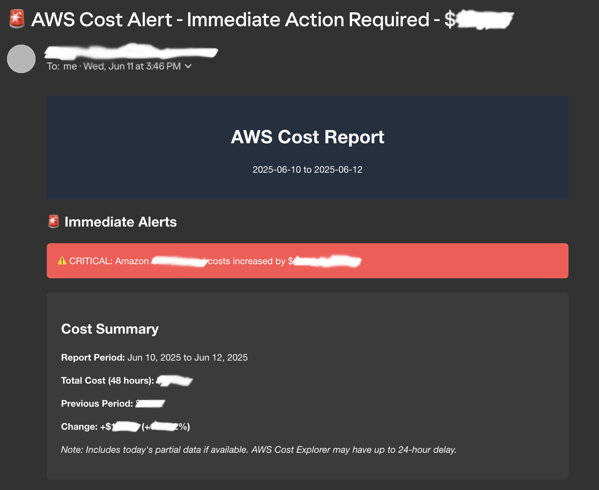

# AWS Cost Monitor

A timezone-aware AWS cost monitoring solution that sends a detailed report once daily and alerts on anomalies to prevent surprise bills. Perfect for catching runaway costs from expensive services like AWS Comprehend, Bedrock, and other AI services before they impact your budget.

> **💰 Running Cost**: This tool costs approximately **$1.50–3/month** to operate (see [cost breakdown](#-monthly-running-cost) below)
> 
> **💡 Pro Tip**: Keep this in a public GitHub repository to get free GitHub Actions CI/CD - no additional costs!

## 🌟 Key Features

This serverless solution automatically monitors your AWS costs across all accounts in your AWS Organization and:

- 📊 **Smart Reporting**: Sends one report daily at 9 PM in YOUR timezone
- 🌍 **Global Timezone Support**: Works anywhere in the world with automatic DST handling
- 📈 **Four Time Periods**: Today so far, Yesterday full, Month-to-date, Previous month full
- 🚨 **Intelligent Alerts**: Immediate notifications when costs spike unexpectedly
- 🎯 **AI Service Focus**: Extra-sensitive monitoring for expensive AI services
- 💰 **Cost Prevention**: Catch issues early before they impact your budget

## 📊 What You'll See in Reports



Each email report includes four key metrics displayed prominently:

1. **Today (so far)** - Today's costs so far (partial — AWS reporting can lag up to 24h)
2. **Yesterday (Full Day)** - Complete 24-hour costs from the previous day
3. **Month to Date** - Running total from the 1st to now
4. **Previous Month** - Last month's complete total for comparison

**Important Note about "Today" costs**: Due to AWS Cost Explorer API limitations and cost considerations, we fetch full day data rather than hourly breakdowns. This means "Today" shows the entire day's costs, which may be incomplete if AWS hasn't reported all costs yet (can take up to 24 hours).

## 🌍 Timezone Configuration

The system supports **all global timezones** with automatic Daylight Saving Time handling:

### Popular Timezone Examples

```bash
# United States (use canonical IANA names — EventBridge Scheduler rejects US/* aliases)
USER_TIMEZONE=America/New_York    # New York, Miami, Atlanta
USER_TIMEZONE=America/Chicago     # Chicago, Dallas, Houston (default)
USER_TIMEZONE=America/Denver      # Denver
USER_TIMEZONE=America/Phoenix     # Phoenix (no DST)
USER_TIMEZONE=America/Los_Angeles # Los Angeles, Seattle, San Francisco

# Europe
USER_TIMEZONE=Europe/London   # UK
USER_TIMEZONE=Europe/Paris    # France, Germany (CET)
USER_TIMEZONE=Europe/Moscow   # Russia

# Asia-Pacific
USER_TIMEZONE=Asia/Tokyo      # Japan
USER_TIMEZONE=Asia/Shanghai   # China
USER_TIMEZONE=Asia/Singapore  # Singapore
USER_TIMEZONE=Australia/Sydney # Australia (AEDT/AEST)

# Americas
USER_TIMEZONE=America/Toronto    # Canada Eastern
USER_TIMEZONE=America/Sao_Paulo  # Brazil
USER_TIMEZONE=America/Mexico_City # Mexico
```

[Full timezone list](https://en.wikipedia.org/wiki/List_of_tz_database_time_zones)

### DST Handling

The system **automatically handles DST transitions**:

- When clocks "spring forward", your 7 AM report stays at 7 AM
- When clocks "fall back", your 7 AM report stays at 7 AM
- No manual adjustments needed - ever!

## 💰 Monthly Running Cost

**Important**: This tool costs approximately **$1.50–3/month** to run, primarily from AWS Cost Explorer API charges:

- **Cost Explorer API**: $1.50-$3/month
  - Each API call costs $0.01 (no free tier)
  - 5-11 API calls per Lambda invocation (depending on pagination)
  - 1 run daily × 30 days = 150-330 API calls/month
- **Other AWS services**: ~$0.05/month (Lambda, SES, CloudWatch Logs, EventBridge Scheduler)
- **Total**: ~$1.50–3/month

*Note: Actual cost depends on number of AWS accounts and services used. Organizations with many accounts may see costs toward the higher end.*

## 🚀 Quick Start

### Prerequisites

- AWS CLI configured with appropriate credentials
- SAM CLI installed (`brew install aws-sam-cli`)
- AWS Organizations set up (or single account)
- Access to deploy Lambda functions and create IAM roles
- Python 3.12 runtime support

### 1. Configuration Setup

```bash
# Clone the repository (if using as template)
git clone https://github.com/yourusername/aws-cost-monitor.git
cd aws-cost-monitor

# Copy the example configuration
cp .env.example .env

# Edit .env with your settings
nano .env  # or vim, code, etc.
```

Example `.env` configuration:

```bash
# Required: Email Configuration
EMAIL_TO=john.doe@company.com,jane.smith@company.com
EMAIL_FROM=aws-costs@company.com

# Required: Set your local timezone
USER_TIMEZONE=US/Eastern  # Change to your timezone!

# Optional: AWS Configuration
AWS_PROFILE=production    # If using named profiles
AWS_REGION=us-east-1     # Defaults to us-east-1

# Optional: Alert Thresholds
ANOMALY_THRESHOLD_PERCENT=50  # 50% increase triggers alert
ANOMALY_THRESHOLD_DOLLARS=50  # AND $50 increase
AI_SERVICE_MULTIPLIER=0.5     # AI services: 25% and $25
```

### 2. Deploy in 2 Minutes

```bash
# Quick deployment using .env file
./deploy.sh

# With specific AWS profile
./deploy.sh --profile production

# Override configuration via command line
./deploy.sh --email-to alerts@company.com --timezone US/Pacific

# See all options
./deploy.sh --help
```

### 3. Post-Deployment Setup

**IMPORTANT**: Verify email addresses in SES before the Lambda can send emails:

1. Go to [SES Verified Identities](https://console.aws.amazon.com/ses/home#/verified-identities)
2. Click "Create identity" → Choose "Email address"
3. Add both EMAIL_TO and EMAIL_FROM addresses
4. Check email and click verification links
5. For production, consider moving out of SES sandbox

### 4. Test Your Setup

```bash
# Manually trigger the Lambda
aws lambda invoke --function-name aws-cost-monitor /tmp/test.json
cat /tmp/test.json

# Check logs
aws logs tail /aws/lambda/aws-cost-monitor --follow

# With profile
aws --profile production lambda invoke --function-name aws-cost-monitor /tmp/test.json
```

## 📧 Email Report Structure

### Report Header

Shows the current date and time in your configured timezone:

```
AWS Cost Report
December 15, 2024 at 1:00 PM EST
```

### Cost Summary Section

Four metric boxes displaying:

- **Today (so far)**: $XXX.XX (partial — the day is still in progress)
- **Yesterday (Full Day)**: $XXX.XX
- **Month to Date**: $X,XXX.XX
- **November (Full Month)**: $X,XXX.XX

### Anomaly Alerts

When detected, shows:

- 🚨 Critical alerts for AI service spikes over $100
- ⚠️ Warnings for services exceeding thresholds
- Both a **live** (today vs yesterday) and **settled** (yesterday vs prior day) comparison

### Detailed Breakdown

- Account-by-account costs for today
- Service-level details within each account
- AI services highlighted in yellow
- Costs under $0.01 are filtered out

## 🎯 Anomaly Detection Logic

The system uses intelligent anomaly detection with two comparisons:

1. **Live** (today so far vs yesterday): catches a spike happening *right now*, even though today's data is still partial due to AWS reporting lag.
2. **Settled** (yesterday vs the day before): the backstop — catches a confirmed spike whose costs only finished posting to Cost Explorer after the prior run.
3. **Dual Thresholds**: both percentage AND dollar thresholds must be exceeded.
4. **AI Service Sensitivity**: AI services use a 0.5x multiplier (more sensitive).

Example scenarios:

- Normal service: Needs >50% AND >$50 increase to alert
- AI service: Needs >25% AND >$25 increase to alert
- Critical: Any AI service increase >$100 triggers immediate alert

**Note**: The live comparison weighs a partial "today" against a full "yesterday," so it only fires when something is genuinely running away (e.g., a runaway Lambda hammering Bedrock). The settled comparison covers costs that post a day late.

## 🔧 Advanced Configuration

### Manual SAM Deployment

```bash
# Build the application
sam build

# Deploy with parameters
sam deploy \
  --stack-name aws-cost-monitor \
  --capabilities CAPABILITY_IAM \
  --parameter-overrides \
    EmailTo=alerts@company.com \
    EmailFrom=noreply@company.com \
    UserTimezone=Europe/London \
    AnomalyThresholdPercent=40 \
    AnomalyThresholdDollars=30
```

### Environment Variables

All settings can be configured via environment variables:

| Variable                    | Required | Default    | Description                            |
| --------------------------- | -------- | ---------- | -------------------------------------- |
| `EMAIL_TO`                  | Yes      | -          | Recipient emails (comma-separated)     |
| `EMAIL_FROM`                | Yes      | -          | Sender email (must be SES verified)    |
| `USER_TIMEZONE`             | No       | America/Chicago | Your local timezone (IANA name)   |
| `AWS_PROFILE`               | No       | default    | AWS CLI profile to use                 |
| `ANOMALY_THRESHOLD_PERCENT` | No       | 50         | Percentage increase threshold          |
| `ANOMALY_THRESHOLD_DOLLARS` | No       | 50         | Dollar amount increase threshold       |
| `AI_SERVICE_MULTIPLIER`     | No       | 0.5        | Sensitivity multiplier for AI services |

### Customizing Schedule Times

The default schedule (once daily at 9 PM local time) is defined in `template.yaml`. Because it uses **EventBridge Scheduler** with `ScheduleExpressionTimezone`, the cron is written in *your local time* — no UTC conversion needed, and it stays fixed across daylight saving.

```yaml
# Current: 9 PM local time, every day
ScheduleExpression: cron(0 21 * * ? *)
ScheduleExpressionTimezone: !Ref UserTimezone

# Example: 8 AM every day
ScheduleExpression: cron(0 8 * * ? *)

# Example: twice daily, 8 AM and 8 PM
ScheduleExpression: cron(0 8,20 * * ? *)
```

## 🛡️ Security & Cost Safety

### Security Features

- Minimal IAM permissions (least privilege)
- Email verification through SES
- No hardcoded credentials
- All data stays in your AWS account
- `.env` files gitignored by default

### Cost Protection

- **Conservative retry logic**: Max 2 attempts per API call
- **Pagination limits**: Max 10 pages per query
- **Lambda timeout**: 5-minute hard limit
- **API call limit**: 5-11 Cost Explorer calls per day (a single run)
- **Free tier friendly**: Well under the 1M free API calls/month

### Monitored AI Services

Special attention with lower thresholds:

- Amazon Bedrock
- Amazon Comprehend
- Amazon Textract
- Amazon Rekognition
- Amazon Transcribe
- Amazon Translate
- Amazon Polly
- Amazon SageMaker

## 🔍 Troubleshooting

### No Emails Received

1. Check SES verified identities
2. Verify Lambda execution in CloudWatch Logs
3. Ensure SES isn't in sandbox mode (production)
4. Check spam/junk folders

### Incorrect Times in Reports

1. Verify `USER_TIMEZONE` is set correctly
2. Check timezone spelling (case-sensitive)
3. Remember: times shown are YOUR local time, not UTC

### Missing Cost Data

- Cost Explorer can have up to 24-hour delay
- Some services report costs delayed
- Ensure Lambda has proper permissions
- Check AWS Organizations access

### View Logs

```bash
# Recent executions
aws logs tail /aws/lambda/aws-cost-monitor

# Live monitoring
aws logs tail /aws/lambda/aws-cost-monitor --follow

# Search for errors
aws logs filter-log-events \
  --log-group-name /aws/lambda/aws-cost-monitor \
  --filter-pattern "ERROR"
```

## 💰 Detailed Cost Breakdown

As mentioned at the top, this tool costs approximately **$5-12/month** to run:

### Cost Explorer API (most of total cost)
- **No free tier** - $0.01 per API request from the first call
- 5-11 API calls per Lambda execution:
  - 1 call each for: today, yesterday, day-before-yesterday, month-to-date, previous month
  - Additional calls if results paginate (many accounts/services)
- 1 execution daily × 30 days = 30 Lambda invocations/month
- 150-330 API calls/month × $0.01 = **$1.50-$3/month**

### Other AWS Services
- **Lambda**: ~$0.01/month (well within free tier)
- **SES**: ~$0.02/month (under free tier for most users)
- **CloudWatch Logs**: ~$0.02/month (minimal logging)
- **EventBridge Scheduler**: FREE (first 14M invocations/month are free; we use ~30)

### Cost Optimization
We use DAILY granularity for all queries to keep costs reasonable. Using HOURLY granularity would increase costs to $100+ per month due to 24x more data points causing heavy pagination.

### Cost Safety Features
- **Maximum 10 pages per query** - Hard limit prevents runaway pagination
- **Conservative retry logic** - Only 1 retry (2 total attempts) per API call
- **Lambda timeout** - 5-minute limit caps total execution time
- **No recursive calls** - Lambda doesn't invoke itself
- **Worst case scenario**: ~$15/month (if every query hit max pagination)

## 🗑️ Uninstall

To remove all resources:

```bash
# Delete the stack
aws cloudformation delete-stack --stack-name AWSDeltaCostUsage

# With profile
aws --profile production cloudformation delete-stack --stack-name AWSDeltaCostUsage

# Clean up local files (optional)
rm -rf .aws-sam/ .env samconfig.toml
```

## 🤝 Contributing

Contributions are welcome! This project is designed to be a template for others to use and customize.

1. Fork the repository
2. Create your feature branch
3. Test your changes thoroughly
4. Submit a Pull Request

## 📝 License

This project is open source and available under the MIT License.

---

Made with ❤️ to prevent AWS bill surprises. Remember to set your timezone!
